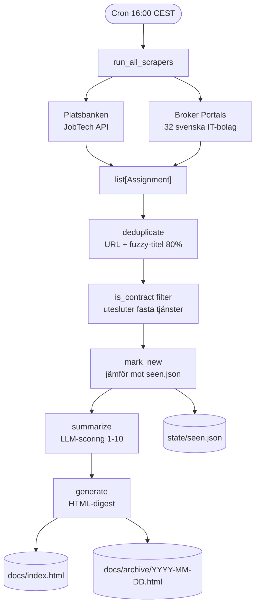
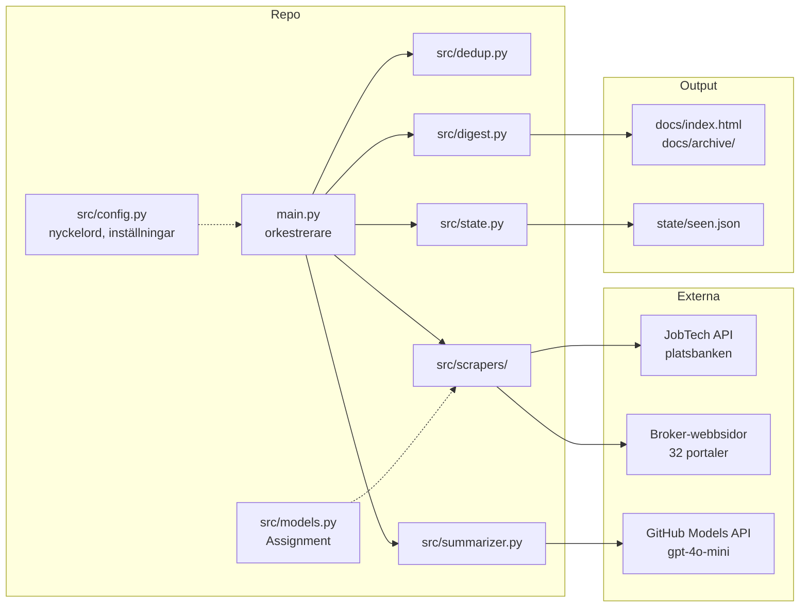
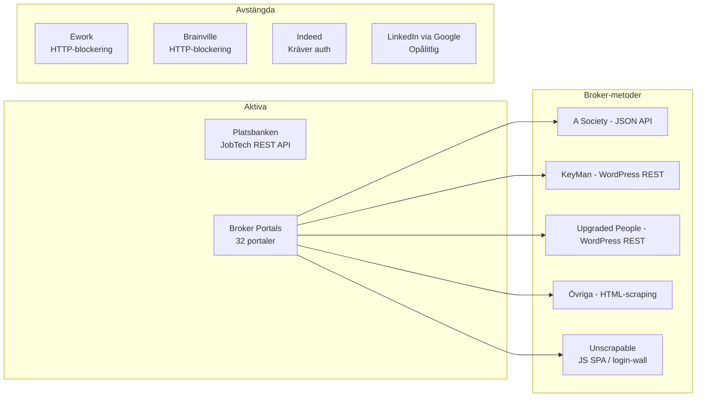
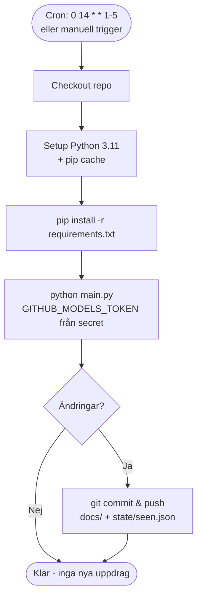

# NI - Contracts

Automatisk daglig sammanställning av Data Engineering / BI / Analytics-konsultuppdrag i Stockholm.

Python + GitHub Actions. Körs varje vardag kl. 16:00 CEST.

---

## Pipeline-flöde



---

## Arkitektur



---

## Scraper-karta



---

## GitHub Actions



---

## Setup

### 1. Lägg till secrets

**Settings → Secrets and variables → Actions:**

| Secret | Värde |
|---|---|
| `SMTP_USER` | Gmail-adressen som skickar mailet |
| `SMTP_PASSWORD` | Gmail **app-lösenord** (16 tecken), inte kontolösenordet |

> LLM-scoringen använder workflowens inbyggda `GITHUB_TOKEN` (permission `models: read`),
> så någon egen PAT behövs inte i CI.

### 2. Skapa Gmail-app-lösenord

Förutsätter att tvåstegsverifiering är påslagen på kontot.

1. Logga in på det Gmail-konto som ska skicka mailet.
2. Gå till <https://myaccount.google.com/apppasswords> (nås inte via en meny i
   säkerhetsinställningarna, använd länken direkt).
3. Skriv ett namn i fältet **App name**, t.ex. `frilansuppdrag`. Namnet är bara en etikett.
4. Klicka **Create**. En ruta visar ett 16-teckens lösenord i fyra grupper, t.ex. `abcd efgh ijkl mnop`.
5. Kopiera det och ta bort mellanslagen (`abcdefghijklmnop`) — det är värdet för `SMTP_PASSWORD`.
   Lösenordet visas bara en gång; tappar du bort det raderar du posten och skapar ett nytt.
6. Lägg Gmail-adressen som `SMTP_USER`.

Om `/apppasswords` svarar att alternativet inte är tillgängligt beror det oftast på att kontot är
ett arbets-/skolkonto (Google Workspace) där administratören blockerat app-lösenord, att
tvåstegsverifieringen bara använder säkerhetsnyckel, eller att Advanced Protection är på. Använd
i så fall ett vanligt `@gmail.com`-konto som avsändare.

Byter du lösenord på Google-kontot slutar app-lösenordet att gälla och måste skapas om.

Mottagare är `simon.stenlund@northintelligence.se` (satt i `src/config.py`, kan överstyras med
miljövariabeln `EMAIL_TO`). Andra leverantörer fungerar via `SMTP_HOST` / `SMTP_PORT`
(t.ex. `smtp.office365.com` / `587`, eller port `465` för implicit TLS).

### 3. Aktivera GitHub Pages (valfritt)

**Settings → Pages** → källa: `docs/`-mappen på `main`.  
Digest publiceras på `https://<username>.github.io/<repo>/`.

### 4. Kör lokalt på ny PC (Windows / PowerShell)

```powershell
python -m venv .venv
.\.venv\Scripts\Activate.ps1
pip install -r requirements.txt
python -m playwright install chromium      # för JS-tunga mäklarportaler

$env:GITHUB_MODELS_TOKEN = "<din_token>"
$env:SMTP_USER = "<din_gmail>"          # valfritt lokalt
$env:SMTP_PASSWORD = "<app_losenord>"   # valfritt lokalt

python -m src.discovery     # (sällan) bygg om state/portals.json
python main.py              # full körning → docs/ + e-post
# Öppna docs/index.html i webbläsaren
```

### 5. Trigga manuellt

**Actions → Daily Contract Digest → Run workflow**

### 6. Synka mot GitHub

Repot initieras lokalt med `git`. Koppla din remote när du har URL:en:

```powershell
git remote add origin https://github.com/<user>/<repo>.git
git push -u origin main
```

---

## Projektstruktur

```
main.py                  # orkestrerare
src/
  config.py              # nyckelord, URL:er, inställningar
  models.py              # Assignment-dataclass
  dedup.py               # deduplicering över källor
  state.py               # hanterar state/seen.json
  summarizer.py          # LLM-scoring + sammanfattning
  digest.py              # HTML-generator → docs/
  notify.py              # mailar nya uppdrag via SMTP
  discovery.py           # djupskanning av Anna Leijons mäklarlista → state/portals.json
  scrapers/
    jobtech.py           # Platsbanken (JobTech API)
    broker_portals.py    # Svenska IT-brokers (läser state/portals.json)
    ework.py             # ework.se (avstängd)
    brainville.py        # brainville.com (avstängd)
    indeed.py            # se.indeed.com (avstängd)
    linkedin_google.py   # LinkedIn via Google (avstängd)
    utils.py             # is_relevant, is_contract, fetch_rendered (Playwright)
docs/
  index.html             # senaste digest
  archive/               # dagligt arkiv YYYY-MM-DD.html
state/
  seen.json              # sedda URL:er (persisteras i Git)
  portals.json           # upptäckta/verifierade mäklarportaler (genereras av discovery)
```

---

## Konfiguration

Allt i `src/config.py`:

- **`KEYWORDS`** — 28 tekniktermer som triggar ett uppdrag (data engineer, power bi, dbt, etc.)
- **`CONTRACT_KEYWORDS`** / **`PERMANENT_KEYWORDS`** — avgör om ett jobb är konsultuppdrag
- **`LOCATION_KEYWORDS`** — stockholm, remote, hybrid
- **`DISABLED_SCRAPERS`** — scrapers som inte körs (Ework, Brainville, Indeed, LinkedIn)
- **`DISABLED_BROKER_PORTALS`** — enskilda portaler som är 404 eller blockerade
- **`MAX_RESULTS`** — max antal uppdrag som skickas till LLM (standard: 30)
- **`LLM_MODEL`** — `gpt-4o-mini` via GitHub Models API

---

## Lägga till en ny scraper

1. Skapa `src/scrapers/min_scraper.py` med signaturen:
   ```python
   async def scrape() -> list[Assignment]:
       ...
   ```
2. Registrera i `SCRAPERS`-listan i `main.py`.
3. Använd `is_relevant()`, `is_contract()`, `is_in_stockholm()` från `scrapers/utils.py` för filtrering.
