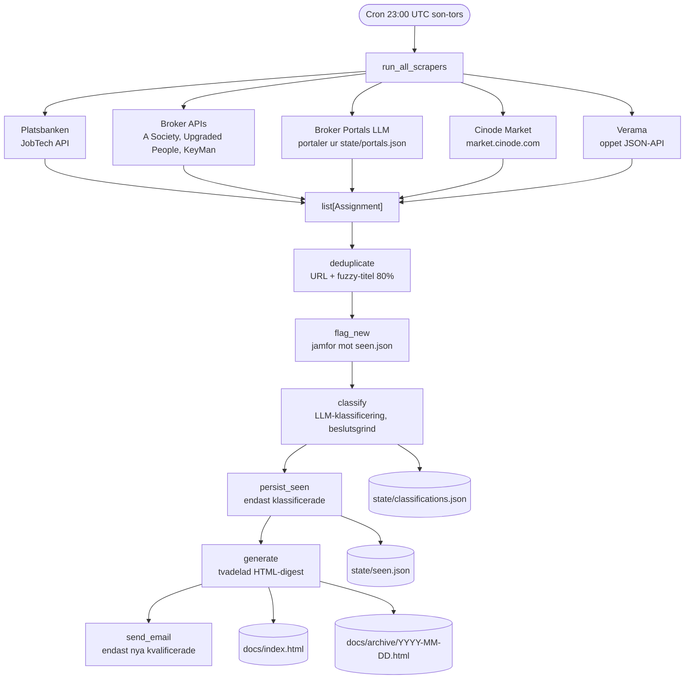
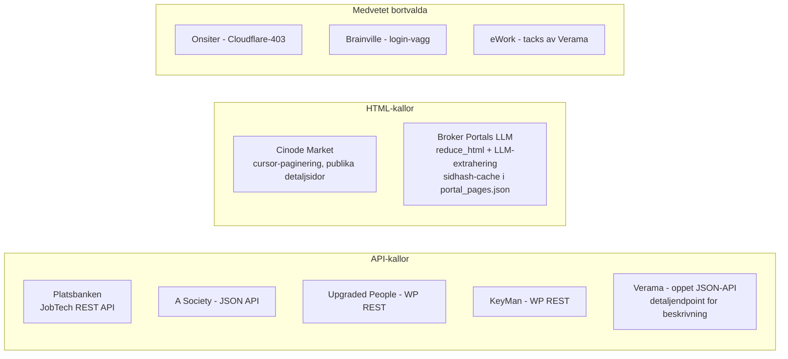

# NI - Contracts

Automatisk daglig sammanställning av frilans-/konsultuppdrag inom Data Engineering / BI /
Analytics i Stockholm. En LLM klassificerar varje annons (uppdragsform, roll, ort, status,
profilpoäng); mailet innehåller bara nya bekräftade uppdrag i rätt roll, webbsidan visar allt
uppdelat i "Uppdrag" och "Osäkra / anställningar".

Python + GitHub Actions. Nattlig körning kl. 23:00 UTC söndag till torsdag (01:00 CEST måndag
till fredag). Portallistan uppdateras månadsvis av en separat discovery-workflow.

---

## Pipeline-flöde



---

## Klassificering och routing

Ett LLM-anrop per annons (Gemini Flash-Lite via Googles OpenAI-kompatibla endpoint,
gratis-tier) returnerar:

| Fält | Värden | Betydelse |
|---|---|---|
| `employment_type` | contract / permanent / unclear | Anställning hos konsultbolag räknas som permanent |
| `role_match` | core / adjacent / none | core = Data Engineer, Analytics Engineer, BI-utvecklare, dataplattform |
| `location_ok` | true / false / null | Stockholm, hybrid eller remote inom Sverige |
| `status` | open / filled / paused / unknown | Tillsatta och pausade uppdrag sorteras bort ur mailet |
| `score` | 1-10 | Enbart teknik-/domänöverlapp mot CV:t; senioritet påverkar inte |
| `summary` | text | 1-2 meningar på svenska |

Routingen (`src/routing.py`) är enda sanningskällan: `is_qualified` kräver contract + core +
open + inte fel ort. Mailet skickar bara nya kvalificerade; webben visar resten med
orsaksetikett (Anställning, Fel roll, Tillsatt, Ej klassificerad, ...). Klassificeringar cachas
i `state/classifications.json` (nyckel: URL + innehållshash + promptversion, TTL 90 dagar) och
en delad budget (`LLM_RUN_BUDGET`) håller körningen inom gratisnivån; oklassificerade annonser
förblir "nya" och tas nästa natt.

---

## Källor



Portal-extraheringen (`src/scrapers/portal_llm.py`) hämtar varje aktiv portal ur
`state/portals.json`, reducerar HTML till läsbar text och låter LLM:en plocka ut uppdragen som
JSON. Oförändrade sidor (samma sidhash) kostar noll LLM-anrop. Extraherade URL:er valideras mot
portalens domän eller kända ATS-domäner.

---

## GitHub Actions

Två workflows:

- **Daily Contract Digest** (`daily-digest.yml`): cron `0 23 * * 0-4` + manuell trigger. Kör
  `python main.py`, committar `docs/` och statefilerna.
- **Monthly Portal Discovery** (`discovery.yml`): cron `0 10 1 * *` + manuell trigger. Kör
  `python -m src.discovery` som skannar Anna Leijons mäklarlista med samma LLM-extrahering som
  nattkörningen och committar `state/portals.json`. Egen budget (`DISCOVERY_LLM_BUDGET`);
  portaler som inte hinns med behåller sin tidigare status.

---

## Setup

### 1. Lägg till secrets

**Settings → Secrets and variables → Actions:**

| Secret | Värde |
|---|---|
| `SMTP_USER` | Gmail-adressen som skickar mailet |
| `SMTP_PASSWORD` | Gmail **app-lösenord** (16 tecken), inte kontolösenordet |
| `GEMINI_API_KEY` | Gratis nyckel från <https://aistudio.google.com/apikey> |

> LLM-anropen går till Google Gemini via det OpenAI-kompatibla endpointet.
> GitHub Models pensionerades 2026-07-30 och kan inte längre användas.

### 2. Skapa Gmail-app-lösenord

Förutsätter att tvåstegsverifiering är påslagen på kontot.

1. Logga in på det Gmail-konto som ska skicka mailet.
2. Gå till <https://myaccount.google.com/apppasswords> (nås inte via en meny i
   säkerhetsinställningarna, använd länken direkt).
3. Skriv ett namn i fältet **App name**, t.ex. `frilansuppdrag`. Namnet är bara en etikett.
4. Klicka **Create**. En ruta visar ett 16-teckens lösenord i fyra grupper, t.ex. `abcd efgh ijkl mnop`.
5. Kopiera det och ta bort mellanslagen (`abcdefghijklmnop`): det är värdet för `SMTP_PASSWORD`.
   Lösenordet visas bara en gång; tappar du bort det raderar du posten och skapar ett nytt.
6. Lägg Gmail-adressen som `SMTP_USER`.

Om `/apppasswords` svarar att alternativet inte är tillgängligt beror det oftast på att kontot är
ett arbets-/skolkonto (Google Workspace) där administratören blockerat app-lösenord, att
tvåstegsverifieringen bara använder säkerhetsnyckel, eller att Advanced Protection är på. Använd
i så fall ett vanligt `@gmail.com`-konto som avsändare.

Byter du lösenord på Google-kontot slutar app-lösenordet att gälla och måste skapas om.

Testa uppgifterna lokalt innan du lägger in dem som secrets (skickar ett mail med ett påhittat
uppdrag):

```powershell
$env:SMTP_USER = "din.adress@gmail.com"
$env:SMTP_PASSWORD = "abcdefghijklmnop"
python -m src.notify --test
```

Mottagare är `simon.stenlund@northintelligence.se` (satt i `src/config.py`, kan överstyras med
miljövariabeln `EMAIL_TO`). Andra leverantörer fungerar via `SMTP_HOST` / `SMTP_PORT`
(t.ex. `smtp.office365.com` / `587`, eller port `465` för implicit TLS).

### 3. Aktivera GitHub Pages (valfritt)

**Settings → Pages** → källa: `docs/`-mappen på `main`.  
Digest publiceras på `https://<username>.github.io/<repo>/`.

### 4. Kör lokalt på ny PC (Windows / PowerShell)

```powershell
python -m venv .venv
.\.venv\Scripts\Activate.ps1
pip install -r requirements.txt
python -m playwright install chromium      # för JS-tunga mäklarportaler

# Gratis nyckel skapas på https://aistudio.google.com/apikey
$env:GEMINI_API_KEY = "<din_nyckel>"
$env:SMTP_USER = "<din_gmail>"          # valfritt lokalt
$env:SMTP_PASSWORD = "<app_losenord>"   # valfritt lokalt

python -m src.discovery              # (sällan) bygg om state/portals.json
python -m src.discovery --limit 10   # partiell testkörning
python main.py                       # full körning → docs/ + e-post
# Öppna docs/index.html i webbläsaren
```

### 5. Trigga manuellt

**Actions → Daily Contract Digest → Run workflow** (nattkörningen)  
**Actions → Monthly Portal Discovery → Run workflow** (portallistan)

---

## Projektstruktur

```
main.py                  # orkestrerare; skapar den delade LLM-budgeten
src/
  config.py              # nyckelord, URL:er, budgetar, inställningar
  models.py              # Assignment-dataclass (inkl. klassificeringsfälten)
  dedup.py               # deduplicering över källor
  state.py               # state/seen.json: {url: senast-sedd-datum}, 180 dagars rensning
  classifier.py          # LLM-klassificerare + LlmBudget
  classify_cache.py      # cache i state/classifications.json
  routing.py             # is_qualified / disqualify_reason
  digest.py              # tvådelad HTML-digest → docs/
  notify.py              # mailar nya kvalificerade uppdrag via SMTP
  discovery.py           # månadsskanning av Anna Leijons mäklarlista → state/portals.json
  scrapers/
    jobtech.py           # Platsbanken (JobTech API)
    broker_apis.py       # A Society, Upgraded People, KeyMan (API:er)
    portal_llm.py        # LLM-extrahering av portalerna i state/portals.json
    cinode_market.py     # Cinode Market (publik HTML)
    verama.py            # Verama (öppet JSON-API)
    utils.py             # is_relevant, is_in_stockholm, httpx-klient, Playwright
docs/
  index.html             # senaste digest
  archive/               # dagligt arkiv YYYY-MM-DD.html
state/
  seen.json              # sedda URL:er med senast-sedd-datum (persisteras i Git)
  classifications.json   # cachade LLM-klassificeringar (persisteras i Git)
  portal_pages.json      # sidhash + senast extraherade uppdrag per portal (persisteras i Git)
  portals.json           # upptäckta/verifierade mäklarportaler (genereras av discovery)
```

---

## Konfiguration

Allt i `src/config.py`:

- **`KEYWORDS`**: tekniktermer som fungerar som billigt prefilter före LLM-klassificeringen
- **`LOCATION_KEYWORDS`**: stockholm, remote, hybrid
- **`LLM_RUN_BUDGET`** / **`PORTAL_LLM_MAX_CALLS`** / **`DISCOVERY_LLM_BUDGET`**: anropstak
  som håller körningarna inom Gemini-gratisnivån (~15 anrop/min, ~1000/dag)
- **`CLASSIFIER_PROMPT_VERSION`**: höj för att medvetet ogiltigförklara klassificeringscachen
- **`EMAIL_MIN_SCORE`**: poängtröskel för mailet (0 = av)
- **`SEEN_MAX_AGE_DAYS`** / **`CLASSIFY_MAX_AGE_DAYS`**: rensning av statefiler
- **`BROKER_PORTALS`**: seed-lista för discovery
- **`DISABLED_BROKER_PORTALS`**: enskilda portaler som är 404 eller blockerade

---

## Lägga till en ny scraper

1. Skapa `src/scrapers/min_scraper.py` med signaturen:
   ```python
   async def scrape() -> list[Assignment]:
       ...
   ```
2. Registrera i `SCRAPERS`-listan i `main.py`.
3. Använd `is_relevant()` från `scrapers/utils.py` som billigt prefilter; uppdragsform, roll
   och ort avgörs av LLM-klassificeraren, inte av scrapern.
